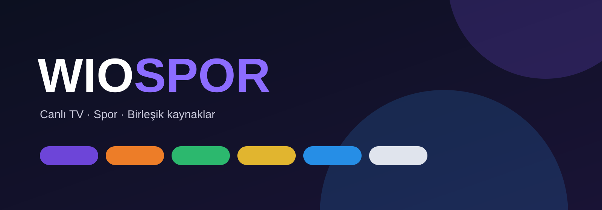

<p align="center"></p>

# WioSpor

Renk gruplarıyla düzenlenmiş canlı TV ve spor kanalları için CloudStream eklentisi.

## CloudStream'e ekle

CloudStream içinde **Eklentiler → Depolar → Depo ekle** yolunu açıp aşağıdaki bağlantıyı girin:

```
https://raw.githubusercontent.com/Wiojelt/WioSpor/main/repo.json
```

Kısa kod: ` `

## Kanallar

- 🟣 Mor Spor — beIN Sports ve beIN Max
- 🟠 Turuncu Spor — Tivibu Spor
- 🟢 Yeşil Spor — tabii Spor
- 🟡 Sarı Spor — Exxen Spor
- 🔵 Mavi Spor — S Sport
- ⭐ Yıldız Spor — Eurosport
- 📺 Ulusal — TRT Spor, A Spor, Sports TV, Smart Spor ve ulusal canlı yayınlar

Bir kanalı açtığınızda, kullanılabilir kaynaklar tek ekranda `kanal · sağlayıcı` biçiminde listelenir. Eklenti ayarındaki **kaynak kontrolü** güncel cevap veren kaynak sayısını gösterir.

Bu depoda yalnızca CloudStream'in yüklemesi için gerekli katalog ve paket dosyaları bulunur.
